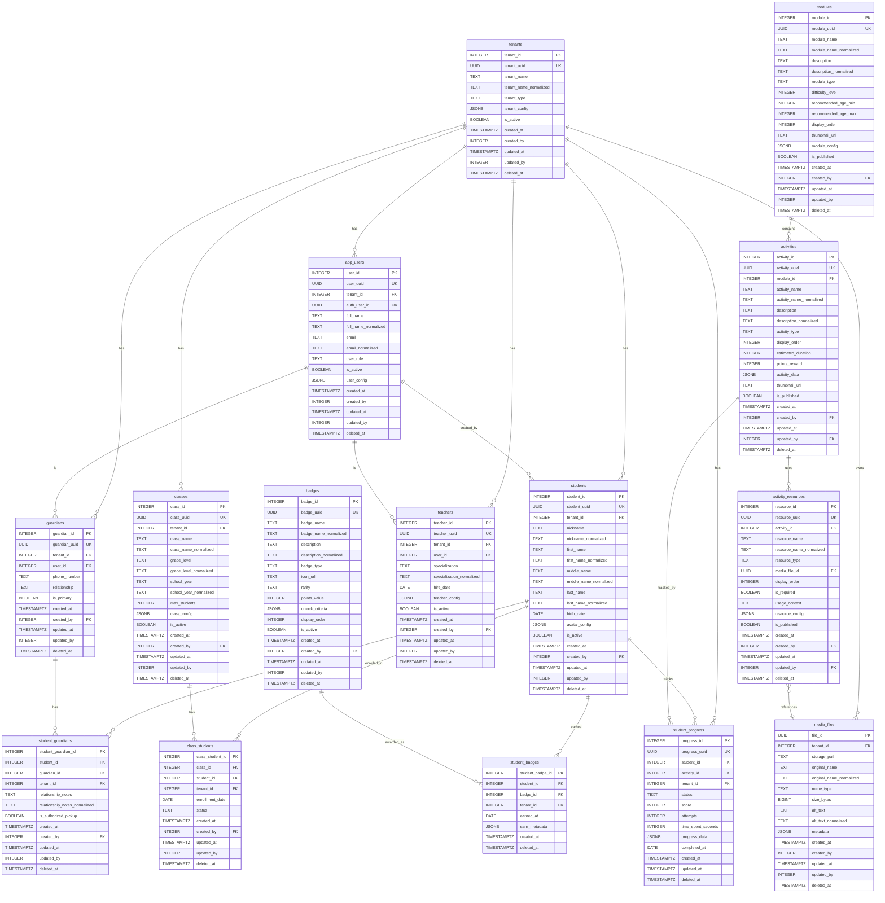

# Database Schema Diagram - Escola Platform

## Entity Relationship Diagram

## Schema Summary

### Identity Schema
- **tenants**: Multi-tenant root (schools/organizations)
- **app_users**: Application users (parents, teachers, admins)

### Assets Schema
- **media_files**: Central media library (images, audio, videos, documents)

### School Schema
- **students**: Child profiles
- **guardians**: Parents/legal guardians
- **student_guardians**: M:N relationship between students and guardians
- **classes**: School classes/groups
- **teachers**: Teacher profiles
- **class_students**: Class enrollment tracking

### Content Schema
- **modules**: Learning modules/courses
- **activities**: Individual learning activities
- **activity_resources**: Links activities to media files (replaces old assets table)

### Game Schema
- **student_progress**: Activity completion tracking
- **badges**: Achievement badges configuration
- **student_badges**: Earned badges by students

## Key Features

### Hybrid ID Strategy
- **Internal ID**: Integer (student_id, teacher_id, etc.) - Database use only
- **External UUID**: UUID (student_uuid, teacher_uuid, etc.) - API/Frontend exposure

### Text Normalization
All TEXT columns have corresponding `*_normalized` columns:
- Lowercase conversion
- Accent removal (unaccent)
- Optimized for Portuguese search (José → jose)
- Indexed for performance

### Audit Trail
All tables include:
- created_at, created_by
- updated_at, updated_by
- deleted_at (soft delete)

### Multi-Tenancy
- RLS (Row Level Security) enabled
- Tenant isolation via tenant_id
- Content tables shared across tenants

## Database Statistics
- **Schemas**: 6 (identity, assets, school, content, game, audit)
- **Tables**: 17
- **Normalized Columns**: 22
- **Extensions**: uuid-ossp, pgcrypto, unaccent
